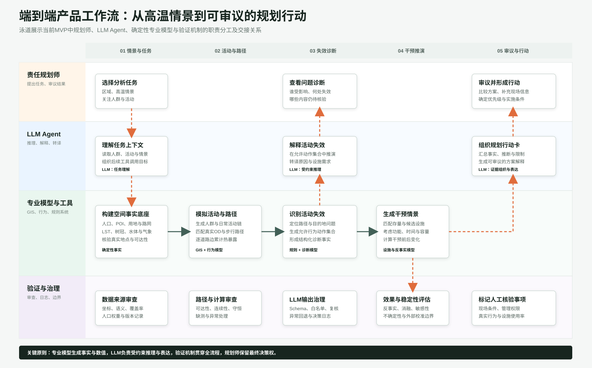

# 高温设施规划 Agent

面向责任规划师的高温设施规划智能体 Demo。项目从“哪里热”继续推进到“影响了谁、阻碍了什么活动、设施如何响应”，使用 GIS 空间核验与受约束 LLM，将静态热风险和设施候选点转化为可解释、可比较、可审议的治理方案。

[在线产品 Demo](https://buqi0015-web.github.io/heat-risk-planning-agent/) · [完整 PRD](docs/完整项目PRD_高温活动失效诊断与清凉设施规划LLM_Agent.md) · [面试技术问答](docs/面试技术深挖问答_高温规划LLM_Agent.md)

> Demo 使用预计算 mock data，不需要 API Key。请优先点击上方在线产品 Demo 查看交互页面。


## 产品定位

传统热风险地图能够发现哪里热，但规划师仍需要继续判断：

- 哪些居民活动正在受到高温影响；
- 风险发生在出发地、路径还是目的地；
- 现有公共设施是否能转化为清凉服务节点；
- 不同干预方案对覆盖率、绕行距离和活动恢复有什么影响；
- 方案依据是否能够被复核、被讨论、被纳入治理行动。

本项目把高温治理问题拆解为“风险诊断、设施与活动核验、活动路线、反事实方案、报告导出”五个产品模块，目标是帮助规划师从空间风险识别走向可执行的设施干预方案。

## Demo 能看什么

- **风险诊断**：查看海淀区高温风险、重点人群、设施缺口与 Agent 诊断结果。
- **设施与活动核验**：把居民活动需求与存量设施承接能力放在同一页核验。
- **活动路线**：查看单次居民活动如何沿道路累计热暴露，包含起点、终点和分段热压力。
- **反事实方案**：比较遮阴、饮水点、休憩点、路径优化等干预方案的模拟效果。
- **报告导出**：展示面向会议汇报和方案审议的一页式材料入口。

## LLM 在项目中的作用

LLM 负责目标理解、活动情境组织、约束转译、方案解释和规划建议生成。坐标、道路、设施、人口、热暴露和覆盖结果来自 GIS 与规则模型，LLM 不直接编造空间事实。

当前设计采用受约束 Agent 思路：

- 规划师输入治理目标，例如“优先保障老人和接送学家庭”；
- 系统先由 GIS 模型生成候选点、路径暴露、设施覆盖和核验条件；
- LLM 在允许动作和结构化事实范围内解释需求、调整策略偏好、组织推荐理由；
- 输出可审议的设施组合、待人工核验事项和反事实比较结果。

## 项目工作流



```text
城市多源数据
  -> 热风险与道路暴露识别
  -> 居民活动与路径模拟
  -> 活动失效诊断
  -> 存量设施核验与候选点生成
  -> LLM 受约束解释与方案组织
  -> 反事实方案比较
  -> 规划师审议与报告导出
```

## 技术栈

| 层级 | 技术与能力 |
|---|---|
| 数据层 | WorldPop、POI、建筑轮廓、EULUC、OSM、Landsat LST、树冠、水体、ERA5-Land |
| 空间计算 | GeoPandas、Rasterio、NetworkX、道路边热暴露、设施覆盖与候选点筛选 |
| 行为模拟 | 居民角色、活动链、时间刚性、绕行容忍、热脆弱性、路径分段暴露 |
| LLM Agent | DeepSeek API、结构化约束、允许动作集合、解释生成、规则校验与降级 |
| 前端 Demo | React、MapLibre GL、Recharts、GitHub Pages |

## 本地运行

```bash
cd app
npm install
npm run dev
```

本地打开终端提示的地址即可。在线 Demo 使用 `app/public/data/showcase.json` 中的精简预计算数据，不需要配置 DeepSeek API。

## 运行构建

```bash
cd app
npm run build
```

仓库已配置 GitHub Actions，推送到 `main` 后会自动构建并部署到 GitHub Pages。

## 关键文档

- [完整项目 PRD](docs/完整项目PRD_高温活动失效诊断与清凉设施规划LLM_Agent.md)
- [研究方法与技术实现归档](docs/研究方法与技术实现归档.md)
- [行为验证、LLM 消融、设施运行与不确定性分析](docs/行为验证_LLM消融_设施运行与不确定性分析.md)
- [逐道路边累计热暴露计算与审查说明](docs/逐道路边累计热暴露计算与审查说明.md)
- [居民起点空间下沉方法与验证](docs/居民起点空间下沉方法与验证.md)
- [面试技术深挖问答](docs/面试技术深挖问答_高温规划LLM_Agent.md)

## 数据说明

公开 Demo 仅包含精简、预计算、可展示的代表性结果。完整原始数据、大规模中间计算结果和敏感配置没有纳入仓库。页面中的数值用于展示产品逻辑、技术路线和交互方式，不能直接解释为真实居民行为预测结果。

## 我的职责

- 从责任规划师工作流程中抽象产品问题与 MVP 范围；
- 设计“热风险识别-活动失效诊断-设施响应-反事实验证”的产品闭环；
- 设计 LLM 与 GIS、规则模型之间的能力边界；
- 搭建交互式 Demo，用于展示 Agent 如何帮助规划师组织证据和生成方案；
- 建立验证、消融、敏感性和不确定性分析框架。
