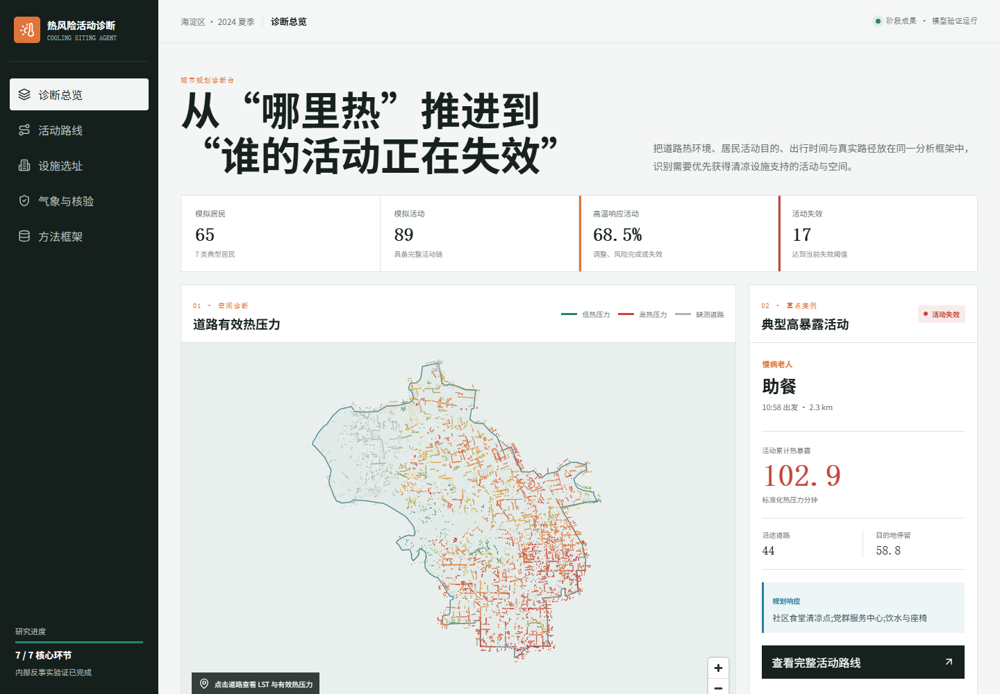

# 高温活动失效诊断与清凉设施规划 LLM Agent

面向责任规划师的 AI 规划辅助产品：识别高温影响了哪些居民活动、问题发生在哪里，并将活动失效转译为可审议的清凉设施需求。

[在线产品 Demo](https://buqi0015-web.github.io/heat-risk-planning-agent/) · [完整 PRD](docs/完整项目PRD_高温活动失效诊断与清凉设施规划LLM_Agent.md) · [模型验证](docs/行为验证_LLM消融_设施运行与不确定性分析.md)

> 在线 Demo 使用预计算、精简后的代表性案例，无需 API Key。当前版本为研究型 MVP，内部有效性指标不代表真实居民行为预测准确率。



## 为什么做

传统热风险地图能够回答“哪里热”，难以继续回答：

- 哪类居民的什么日常活动受到影响；
- 风险发生在出发地、路径还是目的地；
- 附近已有设施为什么仍无法被居民使用；
- 设施介入后能够恢复哪些活动、降低多少暴露。

项目定义“高温活动失效”作为规划需求，将环境风险转化为具体人群、活动和设施响应。


## LLM 的作用与边界

LLM 定位为居民需求与专业规划模型之间的语义推理层。

**当前已实现**

- 在结构化模型生成的允许动作集合内选择高温响应行为；
- 基于活动目的、时间刚性、热暴露、绕行和设施条件生成解释；
- 固定 JSON 输出、动作白名单、规则复核、异常回退与决策日志；
- 完整 LLM、移除空间上下文、移除结构化先验等消融实验。

**LLM 不负责**

- 生成或修改坐标、道路、设施和人口事实；
- 计算最短路径、逐道路边热暴露和设施容量；
- 代替规划师作出最终方案决策。

**下一版本**

- 居民自然语言诉求转译；
- GIS 事实核验后的需求修订；
- 多主体方案审议与规划行动卡。


## 核心用户旅程


## 关键产品决策

| 决策 | 原因 |
|---|---|
| MVP 收敛至海淀区 | 控制数据治理与验证成本，先验证完整闭环 |
| 使用合成人口和代理入口 | 在缺少个人轨迹时保护隐私，并保留空间可追溯性 |
| 使用受约束 LLM | 发挥语义推理能力，同时控制幻觉与不可复现风险 |
| 优先建立验证体系 | 明确区分内部一致性、模型稳健性和外部真实性 |
| 暂缓复杂选址优化 | 先验证活动失效需求能否形成可信规划依据 |

## 当前结果

| 指标 | 结果 |
|---|---:|
| WorldPop 人口统计单元 | 2,073 |
| 正式可采样居民起点 | 1,443 |
| 人口权重守恒误差 | 0 |
| OSM 步行道路边 | 约 19 万条 |
| OD 来源追溯率 | 100% |
| 正式模拟路径成功率 | 100% |
| 行为内部有效性检查 | 7/7 通过 |
| 热压力与行为调整 Spearman 相关 | 0.674 |
| 移除结构化先验后的动作分歧率 | 41.67% |
| 20 点设施情景活动服务覆盖率 | 21.88% |
| 蒙特卡洛覆盖率 P05-P95 | 18.23%-23.96% |

## 技术架构

| 层级 | 主要能力 |
|---|---|
| 数据事实层 | WorldPop、POI、建筑、EULUC、OSM、Landsat LST、树冠、水体、ERA5-Land |
| 空间计算层 | GeoPandas、Rasterio、NetworkX、人口入口下沉、路径与道路环境 |
| 行为模拟层 | 七类居民 Agent、五类出行行为、活动链与热响应 |
| LLM 推理层 | DeepSeek API、允许动作、结构化先验、日志、回退与消融 |
| 评估层 | 反事实验证、敏感性分析、蒙特卡洛分析 |
| 展示层 | React、MapLibre GL、Recharts |

## 仓库结构

```text
app/        可独立运行的在线展示原型
src/        Agent、路径、热暴露、设施与验证核心实现
scripts/    代表性实验和评估脚本
configs/    行为证据与设施运行配置
docs/       PRD、验证报告与方法说明
```

## 本地运行 Demo

```bash
cd app
npm install
npm run dev
```

Demo 使用 `app/public/data/showcase.json` 中的精简预计算案例，不需要 DeepSeek API Key。

## 运行 LLM 决策

将 `.env.example` 复制为 `.env`，填写自己的 DeepSeek API Key。请勿提交 `.env`。

```text
DEEPSEEK_API_KEY=your_key_here
```

核心实现位于 [`src/agents/deepseek_decision.py`](src/agents/deepseek_decision.py)。

## 验证边界

当前已经验证空间来源可追溯性、路径可执行性、诊断链路一致性、热响应方向、多随机种子稳定性、LLM消融及参数不确定性。

当前尚未通过真实问卷、手机信令或设施使用记录验证个体 OD、出发时间、高温行为动作和设施真实使用率。相关结果用于研究与方案比较，不能解释为真实居民行为预测。

## 我的职责

- 从责任规划师工作流程中定义用户问题与产品机会；
- 设计 MVP 范围、PRD、Agent 架构和 LLM 能力边界；
- 设计居民角色、活动失效、设施运行和反事实评估机制；
- 建立 LLM 约束、降级、日志和消融实验；
- 搭建交互式产品原型并制定下一版本路线。

## 数据说明

公开 Demo 仅包含精简、预计算的代表性活动结果。道路展示保留完整路网拓扑，通过压缩坐标精度和非必要属性控制体积；完整原始数据和大规模实验输出未纳入仓库。底图来自 OpenStreetMap，其他数据源及方法详见完整 PRD。


