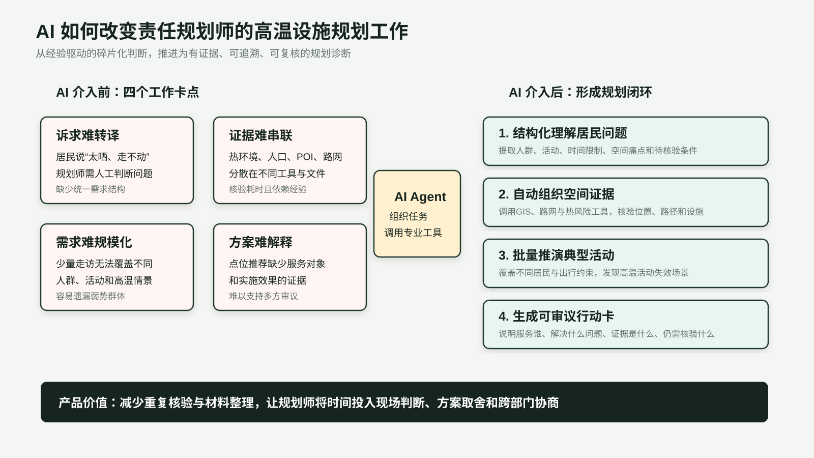
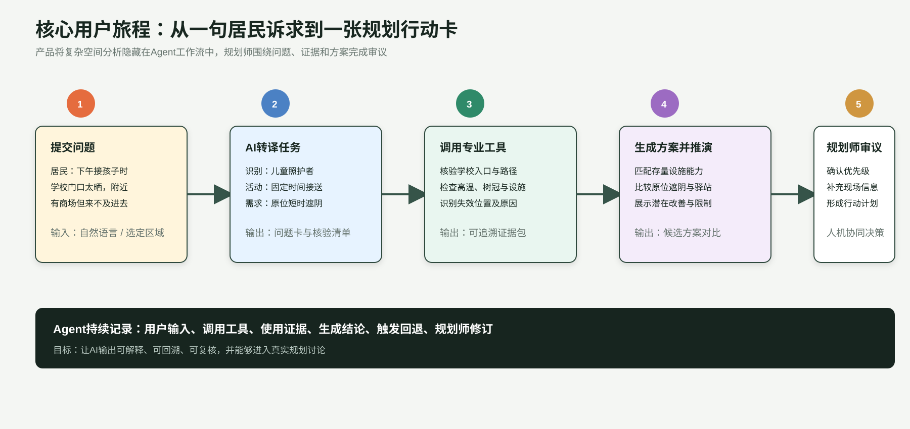
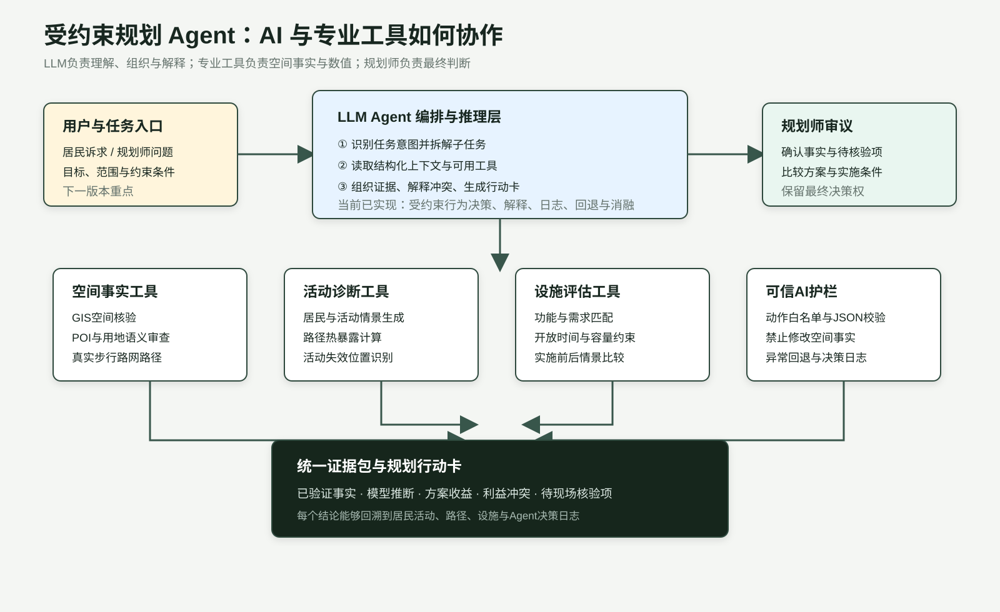
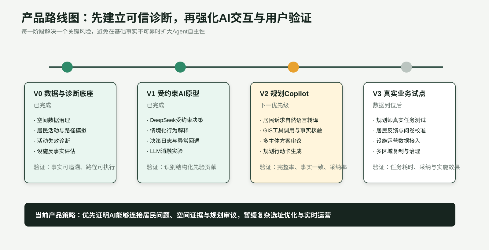

# 高温活动失效诊断与清凉设施规划 AI Agent PRD

## 0. 文档定位

| 项目 | 内容 |
|---|---|
| 产品名称 | 高温活动失效诊断与清凉设施规划 AI Agent |
| 产品形态 | 面向责任规划师的规划 Copilot 与空间诊断工作台 |
| 当前范围 | 北京市海淀区，典型高温情景 |
| 当前版本 | V1.0 可运行研究型 MVP |
| 核心用户 | 责任规划师、街道管理者、社区工作者 |
| 产品目标 | 将居民高温诉求转化为可核验的空间问题、设施需求与规划行动 |
| AI 定位 | 任务编排、需求理解、受约束推理、证据组织与规划解释 |

> 本PRD聚焦用户问题、AI产品方案、核心功能、能力边界、评估体系和迭代路线。空间计算公式、参数与研究依据已移动至《研究方法与技术实现归档》。

---

## 1. 产品概述

### 1.1 一句话定义

帮助责任规划师识别高温影响了哪些居民活动、问题发生在哪里，并基于可追溯空间证据形成可审议的清凉设施行动建议。

### 1.2 产品愿景

让每一条居民诉求都能够被理解、被空间核验、被转化为行动，并能够说明方案为什么值得实施。

### 1.3 核心产品判断

高温设施规划中的核心困难集中在需求识别：

- 热风险地图能够发现高温区域，无法说明高温具体阻碍了哪些日常活动；
- 居民能够描述体验，难以使用规划语言表达人群、活动、时间与空间约束；
- 规划师需要跨越居民沟通、GIS核验、方案设计与效果解释多个工作环节；
- 单纯增加设施点位无法保证居民愿意使用、能够使用或有时间使用。

因此，产品将“高温活动失效”定义为核心需求对象。设施建议围绕具体人群、活动、位置和失效原因生成。

---

## 2. AI介入前的工作卡点

### 2.1 当前工作流

责任规划师处理一项居民高温问题时，通常需要完成：

1. 理解居民的口语化描述；
2. 判断问题属于出发地、路径或目的地；
3. 查找人口、POI、道路、绿地与热环境资料；
4. 核验周边设施是否存在且能够使用；
5. 结合专业经验形成设施响应；
6. 面向居民、街道和管理部门解释方案。

### 2.2 关键卡点

| 卡点 | 具体表现 | 业务影响 |
|---|---|---|
| 居民诉求难结构化 | “太晒”“走不动”“没地方休息”缺少统一表达 | 难以形成可比较的问题清单 |
| 空间证据分散 | 人口、热环境、路网、POI分布在不同工具和文件 | 核验周期长，容易遗漏证据 |
| 需求覆盖有限 | 走访只能覆盖少量居民与地点 | 难以系统识别弱势人群和隐性需求 |
| 设施有效性难判断 | 附近存在设施，居民可能因绕行、时间或功能不匹配无法使用 | 容易形成“有设施、无服务”的方案 |
| 方案解释成本高 | 推荐点位缺少服务对象、失效原因与改善证据 | 难以支持多方审议和资源争取 |

### 2.3 AI产品机会

AI Agent可以将规划任务拆解并组织专业工具，在同一工作流中完成：

- 理解居民诉求并生成核验任务；
- 调用空间工具获取事实；
- 批量推演典型居民活动；
- 组织问题原因、设施需求和方案证据；
- 标记仍需规划师判断或现场核查的内容。

AI不替代规划师的专业判断。产品目标是减少重复检索、核验和材料整理，让规划师集中精力处理方案取舍与跨部门协商。

---

## 3. 目标用户与核心任务

### 3.1 用户角色

| 用户 | 核心任务 | 当前困难 | 产品提供的价值 |
|---|---|---|---|
| 责任规划师 | 将居民诉求转化为规划行动 | 需求零散、核验耗时、方案难解释 | 问题卡、证据包、方案对比与行动卡 |
| 街道管理者 | 确定有限资源的干预优先级 | 缺少统一比较依据 | 重点人群、失效活动与潜在收益 |
| 社区工作者 | 发现居民高温需求并反馈 | 难以表达规划条件 | 低门槛诉求输入与待核验清单 |
| 城市研究人员 | 研究动态热风险与行为响应 | 模型链条分散且难复现 | 可追溯数据、日志、实验与边界说明 |

### 3.2 核心Job To Be Done

> 当规划师收到一项居民高温诉求或需要制定街道清凉设施方案时，希望快速确认谁受到影响、什么活动受到阻碍、问题发生在哪里、现有设施为什么没有发挥作用，并获得可以进入现场核查和方案讨论的证据。

### 3.3 典型用户故事

**居民问题：**

> 下午接孩子时学校门口太晒，附近虽然有商场，但来不及进去休息。

**产品需要协助规划师完成：**

- 识别居民群体：儿童照护者；
- 识别活动约束：固定时间、必要出行、低绕行容忍；
- 核验空间条件：学校入口、通学路径、周边树冠、公共设施和开放条件；
- 判断失效位置：学校入口等候空间或通学路径；
- 形成设施需求：原位遮阴、短时等候、饮水；
- 输出待核验项：入口实际使用情况、可建设空间、管理责任主体。

---

## 4. 产品目标、非目标与成功定义

### 4.1 当前产品目标

1. 将高温风险转化为具体居民活动问题；
2. 让每项诊断能够回溯到真实空间数据与Agent决策记录；
3. 帮助规划师理解附近设施为什么没有产生实际服务；
4. 形成能够进入规划讨论的设施需求和行动建议；
5. 清晰区分已验证事实、模型推断和待核验内容。

### 4.2 当前非目标

- 不替代规划师完成最终方案决策；
- 不声称预测真实个体居民行为；
- 不生成未经空间数据核验的地点或设施；
- 不在当前版本提供实时预警与实时运营；
- 不在当前阶段继续强化复杂选址优化算法；
- 不将AI生成文本直接作为实施结论。

### 4.3 MVP成功定义

| 维度 | 成功标准 |
|---|---|
| 可用性 | 规划师能够从典型居民活动查看问题、证据和设施响应 |
| 可追溯性 | 起点、目的地、路径、设施和AI决策具有来源记录 |
| 可解释性 | 每项活动失效能够说明人群、活动、位置和原因 |
| AI可控性 | LLM仅使用已提供事实，在允许动作和输出结构内运行 |
| 决策支持 | 设施建议能够说明服务对象、功能匹配、实施限制和潜在改善 |
| 诚实边界 | 产品明确展示假设、不确定性和待现场核验事项 |

---

## 5. 产品方案

### 5.1 产品形态

产品由三个界面组成：

1. **问题诊断台**：查看不同居民活动在高温下的失效位置与原因；
2. **规划Copilot**：接收问题、调用工具、组织证据并生成规划行动卡；
3. **方案审议台**：比较不同设施方案、服务对象、运行限制与潜在改善。

### 5.2 核心用户旅程

### 5.3 核心输出

#### 规划问题卡

| 字段 | 示例 |
|---|---|
| 居民诉求 | 下午接孩子时学校门口太晒 |
| 影响人群 | 儿童照护者 |
| 受影响活动 | 固定时间接送 |
| 主要约束 | 时间刚性高、绕行容忍低 |
| 失效位置 | 学校入口与等候空间 |
| 已验证事实 | 入口周边树冠较低，邻近设施需要绕行 |
| 模型推断 | 家长更可能风险完成，难以中途停留 |
| 设施需求 | 原位遮阴、短时等候、饮水 |
| 待核验项 | 实际入口、可建设空间、设施管理权限 |

#### 设施行动卡

- 推荐设施及可复合利用功能；
- 重点服务人群与活动；
- 对应的活动失效原因；
- 开放时间、容量与绕行限制；
- 方案实施后的潜在改善；
- 不确定性与现场核查清单。

---

## 6. AI Agent设计

### 6.1 Agent协作架构

### 6.2 LLM承担的任务

| AI能力 | 产品任务 | 当前状态 |
|---|---|---|
| 受约束情境推理 | 在允许行为集合内判断居民可能如何响应高温，并生成理由 | 已实现 |
| 结果解释 | 将居民、活动、热环境与设施条件组织为可读诊断 | 已实现 |
| 决策日志 | 记录输入上下文、动作、理由、异常与回退来源 | 已实现 |
| 消融实验 | 比较结构化先验、空间上下文对LLM决策的影响 | 已实现 |
| 居民诉求转译 | 将自然语言转为规划问题卡和GIS核验任务 | 已设计，待实现 |
| 多主体方案审议 | 从居民与管理者视角识别方案冲突 | 已设计，待实现 |
| 规划行动卡生成 | 汇总事实、推断、方案收益与待核验项 | 已设计，待实现 |

### 6.3 专业工具承担的任务

| 工具模块 | 负责内容 |
|---|---|
| GIS与遥感工具 | 核验地点、人口、热环境、树冠与水体条件 |
| POI与用地审查工具 | 判断起终点与候选设施是否具有合理空间语义 |
| 路网工具 | 计算真实可步行路径与绕行成本 |
| 活动诊断工具 | 生成典型居民活动并识别失效位置 |
| 设施评估工具 | 检查功能、开放时间、容量与潜在改善 |
| 验证工具 | 检查来源、路径、稳定性、消融与不确定性 |

### 6.4 AI能力边界

LLM不得：

- 修改GIS计算得到的坐标、路径和数值；
- 生成不存在或未经核验的设施；
- 将模型推断标记为已验证事实；
- 绕过动作白名单与固定输出结构；
- 隐藏数据缺失、模型假设与不确定性；
- 代替规划师决定最终实施方案。

### 6.5 可信AI机制

| 风险 | 产品机制 |
|---|---|
| 生成虚假地点 | 地点仅从POI、建筑和路网数据读取 |
| 修改空间事实 | LLM只读结构化上下文，无权写入GIS结果 |
| 输出格式不稳定 | 固定JSON Schema并进行程序校验 |
| 行为判断越界 | 按出行类型提供允许动作集合 |
| API失败 | 自动回退至结构化模型并记录来源 |
| 规划师误用结果 | 强制区分事实、推断、不确定性和待核验项 |

### 6.6 为什么需要LLM

传统规则和GIS工具能够完成确定性计算，难以处理以下任务：

- 理解居民模糊、口语化和上下文相关的诉求；
- 解释多项约束共同作用下的行为原因；
- 将模型输出转化为规划师可使用的问题与行动语言；
- 从多个利益主体视角发现方案冲突；
- 在工具调用结果发生变化后动态修订问题理解。

当前版本的LLM决策稳定性主要来自结构化先验。产品下一阶段将重点验证自然语言转译与多主体审议的独立价值。

---

## 7. 核心功能需求

### F1 问题诊断总览

**用户目标：** 快速判断高温问题主要影响哪些人群、活动和空间。

**功能要求：**

- 展示高温响应活动与活动失效数量；
- 按居民类型、活动类型和失效位置筛选；
- 在地图中展示重点道路、目的地与设施；
- 支持从总体问题进入单项活动案例。

**当前状态：** 已实现。

### F2 典型活动路线诊断

**用户目标：** 理解一次日常活动如何沿路径累积风险。

**功能要求：**

- 展示出发地、目的地和实际步行路径；
- 展示高风险道路边与目的地停留问题；
- 展示活动约束、行为响应与失效原因；
- 关联适合的清凉设施功能。

**当前状态：** 已实现。

### F3 居民诉求转译

**用户目标：** 将居民表达快速转化为可核验规划任务。

**功能要求：**

- 输入居民自然语言诉求；
- 提取人群、活动、时间、痛点与设施需求；
- 生成GIS核验任务；
- 工具核验后由LLM修订问题卡；
- 标记缺失信息与不确定性。

**当前状态：** 已完成流程与Schema设计，待开发。

### F4 设施方案审议

**用户目标：** 判断候选设施是否真正能够解决活动问题。

**功能要求：**

- 展示设施功能、开放时间、容量和公共性；
- 说明服务哪些人群与活动；
- 展示不能服务的需求及原因；
- 比较实施前后的潜在改善；
- 输出现场核验和运营协同事项。

**当前状态：** 基础反事实页面已实现，行动卡待强化。

### F5 多主体方案讨论

**用户目标：** 在方案形成前发现居民需求与运营条件冲突。

**功能要求：**

- 分别生成老人、家长、户外劳动者与设施管理者视角；
- 提取共同需求与冲突；
- 生成可调整的折中条件；
- 由规划师确认最终处理方式。

**当前状态：** 已完成产品设计，待开发。

### F6 证据与验证中心

**用户目标：** 判断产品输出可以信任到什么程度。

**功能要求：**

- 展示数据来源、更新时间和处理状态；
- 展示起终点来源、路径与空间核验结果；
- 展示LLM消融、随机种子稳定性和不确定性；
- 明确当前未完成的外部真实性验证。

**当前状态：** 已实现基础版本。

---

## 8. 关键产品决策与取舍

| 决策 | 选择 | 原因 |
|---|---|---|
| MVP区域 | 首版聚焦海淀区 | 控制数据治理和核验成本，先验证完整闭环 |
| 居民数据 | 使用合成人口和代理入口 | 缺少个人轨迹条件下保护隐私并保持空间可追溯 |
| LLM策略 | 使用受约束LLM | 控制空间幻觉与不可复现风险 |
| 功能优先级 | 先诊断与验证，后强化选址优化 | 需求是否可信决定后续方案价值 |
| 输出形式 | 规划问题卡与行动卡 | 更贴合责任规划师的审议与沟通场景 |
| 验证策略 | 明确内部有效性与外部真实性边界 | 防止将模型运行结果包装为真实行为准确率 |
| 周末差异 | 当前暂缓 | 优先验证核心活动失效机制 |
| 实时运营 | 当前暂缓 | 当前目标为规划辅助，暂不扩展运营系统 |

---

## 9. 数据与系统架构

### 9.1 数据输入

| 数据类型 | 产品用途 |
|---|---|
| 人口与年龄结构 | 表达潜在服务人群与脆弱性 |
| POI、建筑与用地 | 核验居住起点、活动目的地和候选设施 |
| OSM步行路网 | 生成可执行活动路径与绕行成本 |
| LST、树冠、水体与天气 | 描述道路与活动空间的高温条件 |
| 设施属性 | 判断功能、开放时间、容量与使用条件 |

### 9.2 系统分层

| 层级 | 主要职责 |
|---|---|
| 数据事实层 | 保存经过清洗的空间与设施事实 |
| 专业工具层 | 执行GIS、路网、活动诊断与设施评估 |
| Agent编排层 | 理解任务、调用工具、组织证据与生成解释 |
| 可信AI层 | 校验事实、动作、格式、异常与日志 |
| 产品交互层 | 提供诊断、路线、方案、验证与行动卡页面 |

---

## 10. 评估体系

### 10.1 当前已完成的评估

| 评估问题 | 方法 | 当前结论 |
|---|---|---|
| 空间对象是否可追溯 | 起点、目的地、路径与设施来源审查 | 正式案例均保留来源 |
| 路径是否可执行 | OSM连通性、路径成功与连续性检查 | 当前正式样本可执行 |
| 模型是否产生合理热响应 | 热压力与行为调整方向检查 | 呈显著正相关 |
| 结构化先验是否影响LLM | LLM消融实验 | 移除先验后动作分歧明显增加 |
| 结果是否受随机抽样影响 | 多随机种子重复运行 | 失效活动率需要报告区间 |
| 设施方案是否稳定 | 单因素与蒙特卡洛分析 | 服务半径、使用概率和容量影响明显 |

### 10.2 下一阶段AI产品指标

| 指标 | 定义 |
|---|---|
| 诉求转译完整率 | 是否完整提取人群、活动、时间、痛点和设施需求 |
| 事实一致率 | AI输出是否与GIS和结构化数据一致 |
| 无依据地点生成率 | AI是否生成未经核验的地点或设施 |
| 待核验识别率 | AI是否主动识别缺失信息和不确定性 |
| 多主体冲突覆盖率 | AI是否识别主要利益冲突与实施条件 |
| 规划师采纳率 | 输出是否能够进入真实方案讨论 |
| 单案例处理时间 | AI辅助前后完成问题诊断所需时间 |
| 规划师修改次数 | 输出进入行动卡前需要人工修订的次数 |

### 10.3 当前无法声称已验证的内容

- 真实居民个体OD与出发时间；
- 高温下真实取消、延迟和停留行为；
- 清凉设施真实使用概率和小时容量；
- 推荐方案实施后的真实改善；
- AI输出对真实规划任务效率和质量的提升。

---

## 11. 产品路线图

### V0 数据与诊断底座

**状态：已完成**

- 多源空间数据治理；
- 合成居民活动与真实路径；
- 高温活动失效诊断；
- 设施匹配与反事实评估；
- 交互式研究展示。

### V1 受约束AI原型

**状态：已完成**

- DeepSeek受约束行为决策；
- 情境化解释；
- 动作白名单、JSON校验与异常回退；
- 决策日志与消融实验。

### V2 规划Copilot

**状态：下一优先级**

- 居民自然语言诉求转译；
- Agent调用GIS工具核验事实；
- 多主体方案审议；
- 规划问题卡与行动卡自动生成；
- 规划师评价Benchmark。

### V3 真实业务试点

**状态：数据与合作条件到位后启动**

- 小规模责任规划师真实任务测试；
- 居民问卷与行为参数校准；
- 设施运营数据接入；
- 任务效率、采纳率与实施效果评估；
- 多街道和多城市复制。

---

## 12. 风险与控制

| 风险 | 影响 | 控制策略 |
|---|---|---|
| 缺少真实行为数据 | 无法证明个体预测准确 | 明确验证边界，使用问卷与轨迹开展后续校准 |
| POI无法表达真实设施能力 | 设施匹配可能偏差 | 增加开放时间、容量和现场核验字段 |
| LLM生成缺少依据的解释 | 影响规划可信度 | 事实只读、固定结构、来源引用与违规回退 |
| 过度依赖结构化先验 | LLM独立价值不足 | 优先验证诉求转译、多主体审议和工具调用 |
| 规划师误解模拟结果 | 将推断当作事实 | 强制展示事实、推断、不确定性和待核验项 |
| 产品范围持续扩大 | 无法验证核心价值 | 当前聚焦诊断与规划Copilot，暂缓实时运营与复杂优化 |

---

## 13. 当前成果与边界

### 13.1 已形成的产品能力

- 可运行的海淀区高温活动诊断流程；
- 七类居民、五类出行行为和典型活动案例；
- 可追溯起终点与真实步行路径；
- 道路级活动风险与失效位置诊断；
- 受约束LLM决策、解释、日志、回退与消融；
- 设施运行条件与实施前后情景比较；
- 面向规划师的交互式展示页面；
- 完整公开作品集与在线Demo。

### 13.2 当前能力边界

- 使用合成人口，不代表真实个人位置；
- 当前输出用于规划问题发现与方案比较；
- 外部真实性仍需问卷、轨迹、设施运营与规划师实验验证；
- 居民自由文本输入、多主体审议和行动卡自动生成尚待实现；
- 规划师始终保留最终事实判断和方案决策权。

---

## 14. 面试介绍版本

### 30秒产品介绍

我设计了一款面向责任规划师的高温设施规划Agent。传统热风险地图能够发现哪里热，但规划师仍需人工判断高温影响了谁、阻碍了什么活动、设施应该如何响应。产品使用专业空间工具核验人口、路径、热环境与设施条件，使用受约束LLM组织居民活动情境、解释问题并生成可审议证据。当前已经完成诊断、受约束AI、设施反事实和在线Demo，下一版本重点实现居民诉求转译、GIS工具调用和多主体方案审议。

### AI产品经理贡献

- 从责任规划师工作流识别AI产品机会；
- 定义“高温活动失效”作为核心需求对象；
- 设计MVP范围、用户旅程和功能优先级；
- 明确LLM、专业工具和规划师的能力边界；
- 设计可信AI机制、消融实验与产品指标；
- 构建并公开可演示的产品原型；
- 基于当前验证结果制定规划Copilot迭代路线。

---

## 15. 相关文档

- 《研究方法与技术实现归档》：数据处理、模型机制与计算细节；
- 《行为验证、LLM消融、设施运行与不确定性分析》：实验设计与结论；
- 《居民起点空间下沉方法与验证》：合成人口空间表达；
- 《逐道路边累计热暴露计算与审查说明》：道路级诊断机制；
- 在线Demo：`https://buqi0015-web.github.io/heat-risk-planning-agent/`
