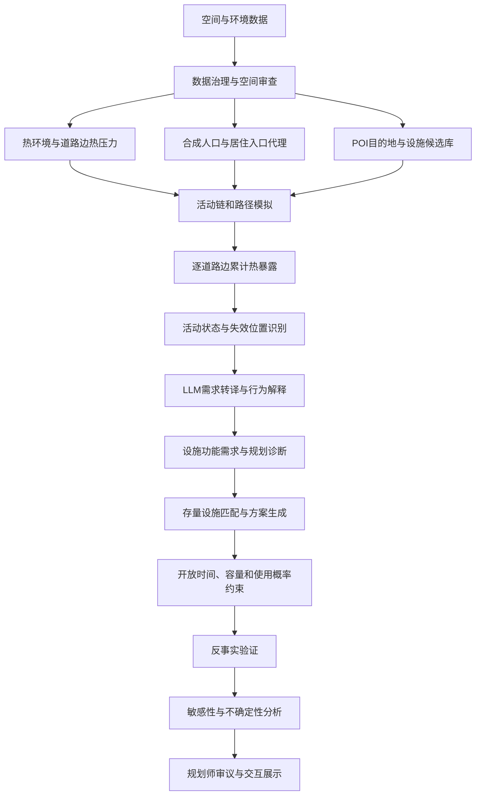

# 高温活动失效诊断与清凉设施规划 LLM Agent 完整 PRD

## 文档信息

| 项目 | 内容 |
|---|---|
| 产品名称 | 高温活动失效诊断与清凉设施规划 LLM Agent |
| 英文名称 | Heat-Risk Activity Failure Diagnosis and Cooling Facility Planning Agent |
| 当前研究范围 | 北京市海淀区 |
| 当前版本 | V1.0 研究原型 |
| 产品阶段 | 已形成可运行、可展示、可审查的端到端研究原型 |
| 核心用户 | 责任规划师、街道管理者、社区工作者、城市研究人员 |
| 核心问题 | 在高温情景下，识别居民日常活动在哪里、因为什么发生失效，并形成可解释的清凉设施规划响应 |
| 文档用途 | 项目实施、面试介绍、作品集展示、论文方法梳理、后续产品迭代 |

---

## 1. 产品摘要

### 1.1 一句话定义

本产品通过热环境数据、合成居民活动模拟、逐道路边热暴露计算和受约束 LLM 推理，识别高温导致居民日常活动难以安全完成的区域，并将活动失效转译为可供规划师审议的清凉设施需求与空间干预建议。

### 1.2 核心产品链路

```text
识别空间热环境
→ 模拟居民日常活动
→ 计算活动全过程热暴露
→ 识别高温活动失效及其位置
→ 将失效原因转译为设施需求
→ 匹配存量设施与候选清凉节点
→ 验证设施实施后的潜在改善
→ 由 LLM 生成可审议的规划解释与居民视角叙事
```

### 1.3 产品核心价值

传统城市热风险分析通常输出“哪里热”。本产品进一步回答：

1. 哪些居民在高温下受到影响。
2. 哪些日常活动受到影响。
3. 热风险发生在出发地、途中还是目的地。
4. 居民为什么难以改变活动或使用附近清凉设施。
5. 哪类存量设施能够承担清凉服务。
6. 推荐设施能够恢复哪些活动、服务哪些人群。
7. 推荐结果对参数变化是否稳定。

### 1.4 产品差异化

| 常见产品或研究路径 | 主要输出 | 本产品的增量 |
|---|---|---|
| 城市热风险地图 | 高温热点、风险等级 | 将热点转化为具体居民活动问题 |
| 传统设施可达性分析 | 服务半径、人口覆盖率 | 加入活动必要性、停留时间、路径热暴露和行为响应 |
| 传统设施选址 | 推荐设施位置 | 解释设施服务谁、恢复什么活动、降低多少暴露 |
| 通用 LLM 规划助手 | 文本建议与问答 | 使用 GIS、路网、POI 和热暴露结果约束 LLM，避免凭空生成空间事实 |
| 通用城市行为模拟 | 合成活动与路径 | 聚焦高温活动失效和清凉设施规划应用 |

---

## 2. 问题背景

### 2.1 现实问题

责任规划师和社区工作者能够接触到大量居民日常诉求，例如：

- 老人在高温时段买菜、取药或就医途中缺少休息点。
- 家长接送儿童时必须按时到达，即使经过清凉设施也难以停留。
- 户外劳动者需要饮水、公厕、充电和短时休息空间。
- 公园、公交站和社区服务设施在高温时段缺少遮阴或开放支持。
- 居民能够描述问题，但难以将问题转化为可分析、可比较的规划需求。

规划师需要完成需求理解、空间核验、方案生成和效果解释。该过程高度依赖专业经验，且难以覆盖大规模、多类型居民情景。

### 2.2 现有研究缺口

1. 县区尺度热风险指标难以直接支持街道内部设施干预。
2. 静态人口与热环境叠加忽略居民实际外出、停留和路径选择。
3. 相同热环境对必要出行和休闲出行产生不同影响。
4. 附近存在设施不代表居民能够、愿意或有时间使用。
5. 设施推荐通常缺少活动恢复和暴露削减验证。
6. LLM 参与规划时容易生成缺少空间依据的建议。

### 2.3 产品机会

通过结构化空间模型负责事实计算，LLM 负责语义理解、需求转译、多主体推演和解释生成，可以形成面向责任规划师的规划辅助 Agent：

```text
空间数据回答“真实空间条件是什么”
行为模型回答“居民可能怎样行动”
LLM 回答“这些行为意味着什么需求、如何解释和协商”
规划规则回答“哪些方案可实施”
```

---

## 3. 产品目标与范围

### 3.1 总体目标

构建一个能够从居民日常活动视角识别高温治理失效区域，并辅助规划师形成清凉设施响应方案的规划 Agent。

### 3.2 当前阶段目标

当前阶段集中完成：

1. 海淀区居民起点、活动目的地和步行路径的可信空间表达。
2. 典型高温日条件下的逐道路边累计热暴露模拟。
3. 活动失效及出发地、路径、目的地问题识别。
4. 行为模拟量化验证和多随机种子稳定性分析。
5. 受约束 LLM 行为决策、解释和消融实验。
6. 存量设施清凉功能匹配和运行约束反事实验证。
7. 面向规划师的交互式展示与行动卡片。

### 3.3 当前暂缓内容

以下内容当前不作为主要开发任务：

- 真实问卷、手机信令、设施客流和外部轨迹验证，等待数据获取后开展。
- 工作日与周末差异建模。
- 选址优化算法继续升级。
- 预算约束、建设成本和多目标整数规划。
- 大规模前端决策参数编辑器。
- 实时气象预警和实时设施运营。

### 3.4 产品成功标准

产品在当前阶段成功需要满足：

1. 所有模拟起点、目的地和路径能够回溯到空间数据来源。
2. 热暴露能够按照道路边、时间和居民脆弱性累计。
3. 每项活动失效能够说明人群、活动、位置和原因。
4. LLM 输出严格遵守行为集合和空间事实约束。
5. 每项设施建议能够说明功能匹配、服务活动和潜在改善。
6. 模型结果能够通过内部一致性、消融、敏感性和不确定性审查。
7. 所有关键假设、待验证项和能力边界能够被清晰展示。

---

## 4. 核心用户与使用场景

### 4.1 用户角色

| 用户 | 核心目标 | 当前痛点 | 产品能力 |
|---|---|---|---|
| 责任规划师 | 将居民诉求转化为空间行动 | 需求零散、核验成本高、方案解释困难 | 需求转译、空间诊断、方案解释 |
| 街道管理者 | 确定优先干预区域和设施 | 资源有限，难以比较方案收益 | 失效热点、设施行动卡、反事实指标 |
| 社区工作者 | 识别重点服务人群与时段 | 依赖经验，缺少空间化证据 | 居民画像、活动失效原因、服务需求 |
| 城市研究人员 | 研究动态热风险与行为响应 | 模型链路分散、难以复现 | 可复现模拟、日志、消融和验证结果 |
| 面试官或项目评审者 | 判断项目完整性和技术深度 | 难以快速理解研究与产品贡献 | 端到端演示、技术路线、能力边界 |

### 4.2 核心使用场景

#### 场景 A：规划师诊断高温治理问题

规划师选择某类居民或某项活动，查看：

- 活动起点和目的地；
- 实际步行路径；
- 高暴露道路边；
- 活动为什么产生风险完成、调整或失效；
- 问题发生在出发地、路径还是目的地。

#### 场景 B：居民诉求转译

居民输入：

```text
下午接孩子时学校门口太晒，附近虽然有商场，但来不及进去休息。
```

LLM 将诉求转译为：

- 人群：儿童照护者；
- 活动：固定时间必要出行；
- 约束：时间刚性高、绕行容忍低、停留概率低；
- 失效位置：学校周边等候点或通学路径；
- 设施需求：原位遮阴、短时等候空间、饮水点；
- 待 GIS 核验内容：学校入口、步行路径、树冠、现有公共空间。

#### 场景 C：设施方案审议

规划师查看某个候选设施：

- 为什么推荐；
- 能够承担哪些清凉功能；
- 服务哪些居民和活动；
- 开放时间是否匹配；
- 容量是否可能不足；
- 在不同参数情景下收益是否稳定；
- 哪些内容仍需现场核查。

#### 场景 D：多主体方案讨论

LLM 分别表达老人、家长、户外劳动者和设施管理者的关注点，形成规划师可审议的冲突清单：

- 老人需要较长停留和健康支持；
- 家长需要原位、短时、不绕行的服务；
- 户外劳动者需要高频、分散、可快速使用的节点；
- 管理者关心开放时段、容量、空间冲突和运营成本。

---

## 5. 产品核心概念

### 5.1 高温活动失效

居民在高温条件下完成某项日常活动时，由于累计热暴露、连续户外时间、活动必要性、人群脆弱性和适应设施不足，产生以下状态：

- 正常完成；
- 风险完成；
- 延迟、替代、缩短或增加停留；
- 取消或无法完成。

### 5.2 高温治理失效区域

空间热环境、居民活动暴露和现有设施适配不足共同作用，导致日常活动难以安全完成的区域。

### 5.3 三类失效位置

| 失效位置 | 定义 | 规划响应 |
|---|---|---|
| 出发地 | 居民从居住区出发前或刚出发即面临高温障碍 | 社区清凉中心、服务下沉、邻里照护 |
| 路径 | 活动途中累计或连续暴露过高 | 遮阴、饮水、清凉驿站、路径优化 |
| 目的地 | 到达、等候或停留阶段风险过高 | 目的地遮阴、开放空间优化、复合服务 |

### 5.4 设施有效服务

设施在空间上接近居民仍不足以产生服务效果。有效服务需要同时满足：

```text
空间可达
× 功能匹配
× 开放时间匹配
× 居民使用概率
× 设施容量
```

---

## 6. LLM 的产品定位

### 6.1 LLM 的核心贡献

LLM 是居民需求与规划专业模型之间的语义和推理层，承担四类核心功能：

1. **居民诉求结构化转译**  
   将居民自然语言转化为人群、活动、时间约束、空间问题、设施需求和待核验条件。

2. **受约束行为推演**  
   在结构化模型给出的允许行为集合内，根据活动目的、热暴露、时间刚性、绕行条件和设施条件选择行为，并生成理由。

3. **多主体规划审议**  
   分别表达不同居民群体和设施管理者对方案的需求、冲突和实施条件，辅助规划师形成折中方案。

4. **规划解释与证据组织**  
   将模型输出组织为规划师可使用的诊断摘要、设施行动卡、方案比较和待核验清单。

### 6.2 LLM 不承担的功能

| 任务 | 责任模块 | LLM 是否负责 |
|---|---|---:|
| 计算地表温度、树冠和水体距离 | GIS 与遥感模块 | 否 |
| 判断坐标是否真实存在 | POI、建筑、边界数据审查 | 否 |
| 计算道路最短路径 | OSM 路网与路径算法 | 否 |
| 计算逐道路边热暴露 | 热暴露计算模块 | 否 |
| 生成人口数量和人口空间分布 | WorldPop 与人口校准模块 | 否 |
| 计算设施容量和开放时间匹配 | 设施运行模块 | 否 |
| 决定最终规划方案 | 规划师与决策规则 | 否 |
| 生成未经数据支持的设施和地点 | 禁止 | 否 |

### 6.3 LLM 输入边界

LLM 仅接收经过结构化模块计算或清洗的上下文：

```json
{
  "resident_profile": "儿童照护者",
  "trip_type": "固定时间必要出行",
  "trip_purpose": "接送儿童",
  "activity_necessity": 1.0,
  "time_rigidity": 0.9,
  "route_mean_heat_stress": 0.72,
  "route_max_heat_stress": 0.94,
  "heat_overlap_minutes": 28,
  "cooling_accessibility": 0.35,
  "cooling_match": 0.20,
  "detour_minutes": 6,
  "allowed_actions": ["normal", "risky_completion", "shorten", "add_stop"]
}
```

### 6.4 LLM 输出边界

LLM 输出必须符合固定 Schema：

```json
{
  "selected_action": "risky_completion",
  "reason": "接送活动时间固定，附近设施绕行成本超过容忍范围，居民可能继续完成活动并承担较高热暴露。",
  "facility_implication": ["学校入口原位遮阴", "短时等候空间"],
  "uncertainty": "该行为尚未通过真实问卷验证"
}
```

### 6.5 LLM 约束机制

1. 只允许从相应出行类型的动作集合中选择。
2. 禁止修改 GIS 计算得到的坐标、路径和暴露值。
3. 禁止生成不存在的设施名称。
4. 输出必须通过 JSON Schema 校验。
5. API 失败、输出违规或超时后自动回退至结构化模型。
6. 所有输入、输出、规则检查和错误写入决策日志。
7. 使用消融实验识别 LLM、空间上下文和结构化先验的实际贡献。

### 6.6 当前 LLM 验证结论

当前消融实验结果：

- 动作白名单、JSON 校验与违规回退机制已通过当前消融样本审查；
- 完整受约束 LLM 与结构化模型在当前小样本上决策一致；
- 移除空间上下文暂未改变动作分布；
- 移除结构化先验后动作分歧率达到 41.67%；
- 结构化先验是当前 LLM 稳定性的主要来源；
- 后续需要通过高热、高绕行、设施冲突和多主体情景强化 LLM 的独立贡献。

---

## 7. 产品总体逻辑



### 7.1 系统分层

| 层级 | 主要职责 |
|---|---|
| 数据事实层 | 边界、人口、POI、建筑、路网、LST、树冠、水体、ERA5 |
| 空间计算层 | 空间裁剪、吸附、路径求解、道路环境采样、可达性计算 |
| 行为模拟层 | 人群抽样、活动链、目的地选择、时间分配、热响应 |
| LLM 推理层 | 诉求转译、受约束决策、多主体审议、解释生成 |
| 规划决策层 | 失效需求、设施功能匹配、反事实和不确定性分析 |
| 产品展示层 | 地图、路线、诊断、行动卡、验证证据和研究边界 |

---

## 8. 技术路线

### 8.1 数据输入

| 数据 | 当前来源 | 主要用途 |
|---|---|---|
| 海淀区边界与街道边界 | 行政区划数据 | 研究范围和空间统计 |
| WorldPop 年龄性别人口 | WorldPop | 人群权重和人口空间分布 |
| 住宅 POI | 已清洗 POI | 居住空间代理 |
| 建筑轮廓与高度 | AI 影像解译 | 住宅建筑入口代理 |
| 活动目的地 POI | 已清洗 POI | 活动目的地和候选设施 |
| EULUC 用地 | EULUC China | 居住和目的地用地语境核验 |
| OSM 步行网络 | OpenStreetMap | 真实可步行路径 |
| Landsat LST | GEE 下载 | 道路和空间热危险 |
| 树冠概率 | GEE 下载 | 遮阴和热适应能力 |
| 水体与水体距离 | Dynamic World 与距离计算 | 冷源环境 |
| ERA5-Land | Copernicus CDS | 典型高温日和逐时天气修正 |

### 8.2 居民起点空间下沉

分级起点代理：

```text
WorldPop 人口单元
→ 住宅 POI 步行入口代理
→ 住宅地块建筑步行入口代理
→ 明确标记的路网节点回退
```

约束条件：

- 海淀区边界；
- EULUC 住宅用地语境；
- 距 OSM 主步行网络不超过 100 米；
- 位于主连通分量；
- 人口权重完整守恒。

当前成果：

- 2,073 个人口统计单元；
- 1,209 个住宅 POI 入口代理；
- 347 个住宅建筑入口代理；
- 517 个路网节点回退；
- 正式可采样起点 1,443 个；
- 人口权重守恒误差为 0。

### 8.3 居民分类

当前人群类型：

| 类型 | 主要活动 | 高温敏感机制 |
|---|---|---|
| 独居老人 | 买菜、助餐、散步 | 脆弱性高、需要休息与照护 |
| 慢病老人 | 买药、就医 | 健康风险高、活动必要性高 |
| 儿童照护者 | 接送、亲子活动 | 时间刚性高、绕行容忍低 |
| 高校学生 | 通学、校园活动 | 活动空间集中、时段明确 |
| 家庭维护型成年人 | 买菜、购物、陪护 | 多任务链和必要性约束 |
| 户外劳动者 | 配送、巡查 | 连续户外暴露、补给需求 |
| 通勤居民 | 通勤接驳 | 固定时段和路径约束 |

### 8.4 出行类型

| 出行类型 | 时间刚性 | 路径灵活性 | 停留概率 |
|---|---:|---:|---:|
| 固定时间必要出行 | 高 | 低 | 低 |
| 弹性时间必要出行 | 中 | 中 | 中 |
| 自由休闲出行 | 低 | 高 | 高 |
| 连续户外工作 | 高 | 中 | 高 |
| 陪护出行 | 中高 | 低 | 中 |

### 8.5 活动链模拟

每个 Agent 的活动过程：

```text
人口权重抽样居民类型
→ 抽样活动数量
→ 根据居民类型选择活动目的
→ 使用 POI 语义、用地语境、道路可达性和距离衰减选择目的地
→ 生成出发时间和停留时间
→ 使用 OSM 路网计算环境感知路径
→ 逐道路边累计热暴露
→ 生成热响应行为和活动状态
```

当前暂不区分工作日和周末。

### 8.6 目的地选择机制

当前目的地选择同时使用：

- 活动目的与 POI 类别匹配；
- POI 名称和细分类语义规则；
- EULUC 用地语境；
- OSM 路网可达性；
- 与起点位于相同路网连通分量；
- 活动目的最大距离；
- 距离衰减抽样。

后续优化方向：

- 增加设施规模、等级和吸引力代理；
- 增加开放时间；
- 增加同类设施竞争；
- 增加活动链连续性规则；
- 使用离散选择模型表达目的地效用。

暂不增加周末差异。

### 8.7 道路边热压力

道路边环境由以下数据构成：

- LST；
- 树冠覆盖；
- 行人遮阴代理；
- 水体距离；
- ERA5-Land 逐时天气修正；
- 缺失环境数据的保守回退值。

### 8.8 累计热暴露

道路边暴露：

\[
Exposure_{g,e}=H_{e,t}\times \Delta t_{g,e}^{heat}\times V_g
\]

路径累计暴露：

\[
RouteExposure_g=\sum_e Exposure_{g,e}
\]

完整活动暴露：

\[
ActivityExposure_g=
RouteExposure_g+
H_{destination,t}\times T_{dwell}^{heat}\times V_g
\]

其中：

- \(H_{e,t}\)：道路边在时间 \(t\) 的有效热压力；
- \(\Delta t_{g,e}^{heat}\)：居民经过道路边并与高温时段重合的分钟数；
- \(V_g\)：居民脆弱性权重；
- \(T_{dwell}^{heat}\)：目的地户外停留与高温时段重合时间。

### 8.9 热响应行为

允许行为：

```text
normal
risky_completion
cancel
delay
substitute
shorten
add_stop
```

结构化模型根据以下变量生成动作概率：

- 热压力；
- 人群脆弱性；
- 活动必要性；
- 时间刚性；
- 路径灵活性；
- 设施可达性；
- 功能匹配；
- 绕行时间和容忍时间；
- 停留概率。

LLM 在允许动作集合内完成受约束推理和解释。

### 8.10 活动失效需求

活动失效需求综合：

\[
D_g =
S_g
\times
\min\left(2,\frac{CED_g}{CED_{fail}}\right)
\times
N_g
\times
V_g
\times
W_g
\]

其中：

- \(S_g\)：活动状态严重度；
- \(CED_g\)：累计热暴露；
- \(CED_{fail}\)：失效阈值；
- \(N_g\)：活动必要性；
- \(V_g\)：居民脆弱性；
- \(W_g\)：公开统计校准权重。

### 8.11 设施运行约束

设施实际干预效力：

\[
OperationalEffect =
BaseEffect
\times OpenMatch
\times UseProbability
\times CapacityFactor
\]

使用概率综合：

- 设施角色；
- 设施公共性；
- 功能类型；
- 出行类型；
- 可接受绕行；
- 情景倍率。

容量因子：

\[
CapacityFactor =
\min\left(1,\frac{HourlyCapacity}{ExpectedHourlyDemand}\right)
\]

模拟活动向小时需求的扩展系数属于透明情景先验，需要真实客流数据校准。

### 8.12 反事实验证

相同居民、活动、路径和高温情景下比较：

```text
现状设施情景
vs.
加入推荐清凉设施情景
```

输出：

- 活动服务覆盖率；
- 暴露削减；
- 失效活动恢复率；
- 高风险活动解决率；
- 设施使用概率；
- 开放时间匹配率；
- 容量因子。

### 8.13 敏感性与不确定性

当前分析变量：

- 服务半径；
- 容量倍率；
- 使用概率倍率；
- 干预效力倍率；
- 活动客流扩展倍率。

分析方法：

- 单因素敏感性分析；
- 30 次蒙特卡洛情景分析；
- 多随机种子行为稳定性分析。

---

## 9. 功能模块与子任务

### M1 数据治理与空间底座

**目标**：确保所有模拟要素具有真实数据来源和可追溯空间位置。

子任务：

- 行政边界统一与坐标系检查；
- POI 字段识别、清洗、去重和分类；
- EULUC 海淀区裁剪；
- OSM 步行路网构建、连通性审查和道路类型过滤；
- 遥感栅格拼接、裁剪和分辨率检查；
- 数据元数据与审查报告输出。

输入：

- 边界、POI、路网、EULUC、遥感和气象数据。

输出：

- 标准化空间数据；
- 数据质量报告；
- 可追溯元数据。

验收标准：

- 坐标系一致；
- 关键字段无缺失；
- OSM 主网络连通；
- POI 坐标通过范围检查；
- 所有输出记录数据来源。

当前状态：已完成。

### M2 热环境与道路边环境

**目标**：构建能够支撑路径热暴露计算的道路边热环境。

子任务：

- LST 处理；
- 树冠概率处理；
- 水体与水体距离计算；
- ERA5-Land 夏季逐时天气处理；
- 道路边环境采样；
- 有效热压力计算；
- 环境覆盖率和缺失值审查。

当前状态：已完成基础版本。

待优化：

- 目的地停留微环境；
- 更精确的行人遮阴；
- 真实气温观测校准。

### M3 合成人口与居住入口代理

**目标**：将人口权重下沉至具有居住语义和步行可达性的入口代理。

子任务：

- WorldPop 人口聚合；
- 年龄人群权重生成；
- 政府人口总量校准；
- 住宅 POI 入口匹配；
- 住宅建筑入口代理构建；
- OSM 路网吸附；
- 人口权重守恒检查。

当前状态：已完成。

### M4 活动与目的地模拟

**目标**：生成具有居民类型、活动目的、真实目的地和空间约束的日常活动链。

子任务：

- 人群类型定义；
- 出行类型定义；
- 活动目的规则；
- POI 目的地语义筛选；
- 用地与路网约束；
- 距离衰减抽样；
- 出发时间和停留时间生成；
- 活动链连续性检查。

当前状态：已完成基础版本。

当前重点优化：

- 引入设施规模和吸引力；
- 强化活动链逻辑；
- 增加目的地选择解释；
- 暂不加入周末差异。

### M5 路径与热暴露模拟

**目标**：计算每项活动沿真实步行道路累积的动态热暴露。

子任务：

- OSM 路径计算；
- 环境感知路径偏好；
- 道路边进入和离开时间；
- 与高温时段重合时间；
- ERA5-Land 逐时修正；
- 道路边暴露；
- 路径累计暴露；
- 目的地停留暴露；
- 距离、时间、暴露守恒审查。

当前状态：已完成。

### M6 结构化行为模型

**目标**：提供透明、可复现的行为响应基线。

子任务：

- 动作集合定义；
- 不同出行类型允许动作；
- 热响应动作概率；
- 绕行惩罚；
- 设施停留概率；
- 活动状态判断；
- 决策日志。

当前状态：已完成。

### M7 LLM 居民需求与规划推理

**目标**：强化 LLM 在需求理解、受约束推演、多主体审议和规划解释方面的贡献。

#### M7.1 居民诉求结构化转译

输入：

- 居民自然语言诉求；
- 可选居民画像；
- 可选位置或活动信息。

输出：

- 人群类型；
- 活动目的；
- 时间刚性；
- 路径灵活性；
- 停留倾向；
- 设施需求；
- 待 GIS 核验条件；
- 信息缺口和不确定性。

验收标准：

- 输出符合 Schema；
- 不生成未经核验的地点；
- 明确区分居民陈述、模型推断和待核验事实。

当前状态：待开发，属于下一阶段最高优先级。

#### M7.2 受约束行为决策

输入：

- 结构化居民和活动上下文；
- GIS 计算的路径和热暴露；
- 允许动作集合。

输出：

- 行为动作；
- 决策理由；
- 设施含义；
- 决策来源和错误日志。

当前状态：已完成并完成消融实验。

待优化：

- 扩大高风险配对样本；
- 构建专门区分空间上下文贡献的测试集；
- 增加置信度和反思字段；
- 检验不同模型和 Prompt 的稳定性。

#### M7.3 多主体方案审议

输入：

- 设施方案；
- 不同居民群体利益；
- 设施运营条件；
- 规划实施约束。

输出：

- 各主体支持点；
- 各主体反对点；
- 主要冲突；
- 可接受折中；
- 需要补充的数据；
- 规划师审议摘要。

当前状态：待开发，属于下一阶段最高优先级。

#### M7.4 规划解释生成

输入：

- 失效需求；
- 设施匹配结果；
- 反事实与不确定性结果；
- 待核验项。

输出：

- 诊断摘要；
- 设施行动卡；
- 方案比较；
- 居民视角解释；
- 技术边界和风险提示。

当前状态：已具备基础模板，待接入 LLM 生成与事实校验。

### M8 活动失效诊断

**目标**：将热暴露和行为响应转化为规划问题。

子任务：

- 活动状态识别；
- 失效位置识别；
- 需求权重计算；
- 路径道路边需求聚合；
- 热点单元识别；
- 人群和活动类型诊断；
- 设施需求转译。

当前状态：已完成基础版本。

### M9 设施候选与方案验证

**目标**：将失效需求匹配到可复合利用的存量设施，并量化潜在改善。

子任务：

- 候选设施语义分类；
- 公共性和冲突风险；
- 设施功能匹配；
- 开放时间；
- 容量；
- 使用概率；
- 反事实改善；
- 敏感性与不确定性。

当前状态：已完成基础版本。

当前范围约束：

- 暂不继续优化选址算法；
- 当前设施方案用于证明完整闭环和规划解释；
- 后续获得运营数据后校准容量、开放时间与使用概率。

### M10 行为模拟量化验证

**目标**：明确模型可以验证到什么程度，避免将内部一致性解释为真实准确率。

子任务：

- OD 来源追溯；
- 目的地语义和用地匹配；
- 路径成功率；
- 道路环境覆盖；
- 行为规则合规；
- 热响应单调性；
- 公开统计宏观校准；
- 多随机种子稳定性；
- LLM 消融；
- 敏感性和不确定性。

当前结果：

- 7/7 项内部有效性检查通过；
- 热压力与行为调整显著正相关；
- 5 个随机种子的路径成功率均为 100%；
- 失效活动率对随机抽样较敏感；
- 外部真实性验证等待真实数据。

### M11 交互式规划展示

**目标**：让规划师、评审者和面试官能够理解完整链路和典型案例。

当前页面：

- 诊断总览；
- 活动路线；
- 气象与核验；
- 方法框架；
- 选址与反事实结果。

下一阶段重点：

- 增加居民自然语言诉求输入；
- 展示 LLM 结构化转译结果；
- 展示多主体审议对话；
- 展示事实、推断和待核验项；
- 暂不开发复杂选址参数调整器。

---

## 10. LLM 强化路线

### 10.1 强化目标

LLM 的价值需要从“为结构化决策生成解释”提升为“连接居民诉求、模型证据和规划师审议的核心交互层”。

### 10.2 下一阶段 LLM 功能优先级

| 优先级 | 功能 | 产品价值 |
|---:|---|---|
| P0 | 居民自然语言诉求转译 | 体现参与式规划和责任规划师场景 |
| P0 | 多主体方案审议 | 体现 LLM 在冲突识别与协商中的独立贡献 |
| P0 | 事实约束与证据引用 | 控制幻觉，保证规划可审查性 |
| P1 | 高风险活动情景推演 | 扩大 LLM 行为决策贡献 |
| P1 | 规划行动卡自动生成 | 降低规划师整理和表达成本 |
| P1 | Prompt 与模型消融 | 量化 LLM 贡献和稳定性 |
| P2 | 居民反馈持续更新 | 真实反馈数据获取后开展 |

### 10.3 居民诉求转译流程


### 10.4 规划问题卡片 Schema

```json
{
  "resident_statement": "下午接孩子时学校门口太晒",
  "resident_group": "儿童照护者",
  "activity": "接送儿童",
  "trip_type": "固定时间必要出行",
  "time_constraint": "高",
  "detour_tolerance": "低",
  "suspected_failure_zone": "目的地",
  "facility_needs": ["原位遮阴", "短时等候空间", "饮水"],
  "gis_checks": [
    "核验学校入口位置",
    "核验入口50米树冠覆盖",
    "核验附近公共设施开放时间"
  ],
  "verified_facts": [],
  "model_inferences": [],
  "uncertainties": []
}
```

### 10.5 多主体审议流程

```text
设施方案
→ 老人视角评议
→ 家长视角评议
→ 户外劳动者视角评议
→ 设施管理者视角评议
→ LLM 提取冲突和共同需求
→ 规划师确认折中方案
```

### 10.6 LLM 质量评价

| 指标 | 定义 |
|---|---|
| Schema 合规率 | 输出是否符合固定字段 |
| 事实一致率 | 输出是否与 GIS 和结构化数据一致 |
| 规则合规率 | 行为是否属于允许集合 |
| 无依据地点生成率 | 是否生成不存在或未经核验的地点 |
| 需求转译完整率 | 是否提取人群、活动、时间、痛点和设施需求 |
| 待核验识别率 | 是否识别缺失信息和不确定性 |
| 多主体冲突覆盖率 | 是否识别关键利益冲突 |
| 规划师采纳率 | 规划师是否认为输出具有使用价值 |

---

## 11. 数据与模型验证策略

### 11.1 当前可以验证的内容

- 数据完整性；
- 空间来源可追溯性；
- POI 与用地语境合理性；
- 道路网络连通性；
- 路径成功率；
- 距离、时间和暴露守恒；
- 行为规则合规；
- 热压力与行为调整方向；
- 多随机种子稳定性；
- LLM 消融；
- 参数敏感性和不确定性。

### 11.2 当前无法声称已经验证的内容

- 个体居民真实 OD；
- 真实出发时间和停留时间；
- 高温下真实取消、延迟和停留行为；
- 清凉设施真实使用概率；
- 设施真实小时容量；
- 推荐设施实施后的真实暴露削减；
- LLM 输出对真实规划决策的实际提升。

### 11.3 外部验证数据到位后的任务

待数据获取后开展：

- GeoLife 或其他轨迹分布对比；
- 北京交通统计分布对比；
- 设施开放时间和容量校准；
- 小规模居民问卷；
- 规划师输出评价；
- 典型区域人工核验；
- 真实使用记录与反事实结果对比。

---

## 12. 关键指标

### 12.1 产品指标

| 指标 | 说明 |
|---|---|
| 可解释活动失效记录数 | 能够说明人群、活动、位置和原因的活动数量 |
| 规划问题卡片完整率 | 居民诉求被完整转译的比例 |
| 规划师审议可用率 | 规划师认为输出能够进入讨论的比例 |
| 设施行动卡事实一致率 | 建议与空间数据一致的比例 |

### 12.2 模型指标

| 指标 | 当前作用 |
|---|---|
| OD 来源追溯率 | 防止凭空生成地点 |
| 道路路径成功率 | 验证路径可执行性 |
| 目的地语义匹配率 | 验证活动与目的地合理性 |
| 行为规则合规率 | 验证 LLM 和结构化行为边界 |
| 热响应单调性 | 验证热压力升高时行为调整方向 |
| 多种子变异系数 | 验证随机抽样稳定性 |
| LLM 动作分歧率 | 衡量 LLM 相对结构化模型的增量 |
| 暴露削减区间 | 表达设施收益不确定性 |

### 12.3 当前关键结果

| 指标 | 当前结果 |
|---|---:|
| 正式可采样居民起点 | 1,443 |
| 首活动起点位于海淀区 | 100% |
| 路径成功率 | 100% |
| OD 来源追溯率 | 100% |
| 行为内部有效性检查 | 7/7 通过 |
| 热压力与行为调整 Spearman 相关 | 0.674 |
| 移除结构化先验后的动作分歧率 | 41.67% |
| 20 点平衡网络活动服务覆盖率 | 21.88% |
| 蒙特卡洛活动服务覆盖率 P05-P95 | 18.23%-23.96% |

---

## 13. 非功能需求

| 要求 | 具体标准 |
|---|---|
| 可追溯性 | 每个起点、目的地、路径、设施和 LLM 决策具有来源记录 |
| 可解释性 | 每项活动状态和设施建议具有原因 |
| 可复现性 | 保存随机种子、参数、数据路径和运行元数据 |
| 事实约束 | LLM 不得修改 GIS 事实或生成未经核验地点 |
| 可回退性 | LLM 失败时使用结构化决策 |
| 稳定性 | 通过多随机种子和敏感性分析报告波动 |
| 隐私性 | 当前使用合成人口，不使用个人真实住址 |
| 可维护性 | 数据处理、行为模拟、LLM、验证和展示模块分离 |
| 性能 | 100 个居民完整模拟能够在本地分钟级完成 |
| 展示性 | 面试和会议中能够通过浏览器演示典型案例 |

---

## 14. 风险与控制

| 风险 | 影响 | 控制措施 |
|---|---|---|
| 缺少真实行为数据 | 无法声明真实准确率 | 明确区分内部有效性和外部验证 |
| POI 不能表达设施规模 | 目的地和设施吸引力偏差 | 增加规模代理，保留待核验标记 |
| 建筑用途推断错误 | 居民起点偏差 | EULUC 住宅语境约束和抽样核验 |
| LLM 幻觉 | 生成错误地点或建议 | 固定 Schema、允许动作、事实校验和自动回退 |
| 参数主观性 | 结果受假设影响 | 敏感性和蒙特卡洛分析 |
| 单次随机模拟偏差 | 失效数量波动 | 多随机种子稳定性报告 |
| 容量和开放时间是假设 | 设施收益偏差 | 透明配置、情景分析和后续运营数据校准 |
| 项目范围过大 | 难以形成清晰贡献 | 当前聚焦 LLM 需求转译和规划审议 |

---

## 15. 当前实施状态

| 模块 | 状态 | 说明 |
|---|---|---|
| 数据治理 | 已完成 | POI、人口、建筑、路网、环境数据已处理 |
| 居民起点空间下沉 | 已完成 | 住宅 POI、住宅建筑、路网回退分级 |
| OSM 路径模拟 | 已完成 | 主步行网络和环境感知路径 |
| 逐道路边热暴露 | 已完成 | 已通过守恒和连续性审查 |
| 活动链模拟 | 已完成基础版 | 待提升目的地吸引力和链式逻辑 |
| 结构化行为决策 | 已完成 | 透明规则基线 |
| 受约束 LLM 决策 | 已完成 | 已完成消融 |
| 居民诉求 LLM 转译 | 待开发 | 下一阶段 P0 |
| 多主体 LLM 审议 | 待开发 | 下一阶段 P0 |
| 活动失效诊断 | 已完成基础版 | 已输出失效需求和热点 |
| 设施运行约束 | 已完成基础版 | 容量、开放时间、使用概率 |
| 反事实验证 | 已完成基础版 | 模型内部反事实 |
| 敏感性与不确定性 | 已完成 | 单因素和蒙特卡洛 |
| 外部验证 | 等待数据 | 获取数据后开展 |
| 交互式页面 | 已完成基础版 | 待增加 LLM 诉求与审议界面 |

---

## 16. 下一阶段任务拆解

### 阶段 A：强化 LLM 核心产品贡献

#### A1 居民诉求转译模块

任务：

1. 定义居民诉求输入 Schema。
2. 定义规划问题卡片输出 Schema。
3. 设计 Prompt 和少样本示例。
4. 增加事实、推断和待核验字段。
5. 接入 GIS 核验任务生成。
6. 构建 30-50 条典型居民诉求测试集。
7. 评价结构化完整率和无依据事实率。

交付物：

- `resident_request_schema.json`；
- LLM 转译接口；
- 测试集；
- 转译质量报告；
- 页面输入和结果展示。

#### A2 多主体规划审议模块

任务：

1. 定义居民群体与设施管理者角色。
2. 定义主体可使用的事实上下文。
3. 定义冲突、共同需求和折中方案 Schema。
4. 对典型设施方案生成多主体评议。
5. 增加规划师最终确认步骤。
6. 记录每项结论使用的事实依据。
7. 开展无角色、无空间事实和完整审议消融。

交付物：

- 多主体审议服务；
- 冲突清单；
- 折中建议；
- 事实引用；
- 消融报告。

#### A3 LLM 规划行动卡

任务：

1. 将设施候选结果转换为 LLM 上下文。
2. 生成面向规划师的行动卡。
3. 生成面向居民的解释文本。
4. 自动列出现场核验任务。
5. 对所有陈述执行事实一致性检查。

### 阶段 B：优化活动与目的地模拟

#### B1 目的地吸引力

任务：

- 增加设施规模代理；
- 增加 POI 等级；
- 增加开放时间；
- 增加同类设施竞争；
- 构建目的地效用函数；
- 输出每次目的地选择的效用分解。

#### B2 活动链逻辑

任务：

- 增加活动顺序合理性；
- 增加回家机制；
- 增加陪护和接送的链式约束；
- 增加户外劳动者连续任务；
- 增加异常活动链审查。

当前不加入周末差异。

### 阶段 C：产品展示强化

任务：

- 增加居民诉求输入框；
- 展示 LLM 转译后的规划问题卡；
- 展示 GIS 核验过程；
- 展示多主体审议和冲突；
- 展示模型事实、LLM 推断和待核验项；
- 增加面试演示预设案例；
- 增加一键导出案例报告。

### 阶段 D：等待数据后的外部验证

任务暂缓，数据到位后启动：

- 轨迹分布对比；
- 真实 OD 核验；
- 设施运营校准；
- 居民行为问卷；
- 规划师评价实验；
- 实施后效果评估。

---

## 17. 面试展示建议

### 17.1 三分钟项目介绍

```text
我做的是一个面向责任规划师的高温活动失效诊断与清凉设施规划 Agent。

很多热风险研究只能说明哪里热，难以回答具体居民为什么无法完成买菜、接送孩子、
取药或户外工作。我将 WorldPop 合成人口、住宅 POI 和建筑入口、OSM 步行网络、
Landsat LST、树冠、水体和 ERA5-Land 结合起来，模拟居民活动链，并按实际道路边
累计热暴露。

系统能够识别活动失效发生在出发地、路径还是目的地，并将问题转化为清凉设施需求。
LLM 在其中负责居民诉求转译、受约束行为推演、多主体方案审议和规划解释；空间位置、
路径、热暴露和设施运行条件均由结构化模型计算，控制 LLM 幻觉。

目前项目已经完成端到端模拟、行为量化验证、LLM 消融、设施运行约束、反事实验证和
不确定性分析，并通过交互式网页展示典型活动路线和规划方案。
```

### 17.2 面试重点展示顺序

1. 现实问题：热风险地图无法直接转化为设施行动。
2. 核心洞察：设施需求来自具体居民活动失效。
3. 技术闭环：空间事实、行为模拟、LLM 推理、规划响应、反事实验证。
4. LLM 边界：负责语义推理和审议，不负责空间事实计算。
5. 工程难点：住宅入口下沉、OSM 路网、逐道路边热暴露、可追溯性。
6. 科学性：内部验证、多种子稳定性、消融和不确定性。
7. 产品价值：帮助责任规划师从居民诉求形成可审议方案。
8. 当前限制和下一步：外部数据等待中，重点强化 LLM 诉求转译和多主体审议。

### 17.3 面试中应主动说明的边界

- 当前使用合成人口，未使用真实居民个人轨迹。
- 内部有效性得分不代表真实行为预测准确率。
- 设施容量、开放时间和使用概率仍属于透明情景先验。
- LLM 的行为决策贡献目前有限，结构化先验保障了稳定性。
- 下一阶段将 LLM 核心价值集中在居民诉求转译和多主体规划审议。

---

## 18. 简历表达建议

### 18.1 项目名称

```text
高温活动失效诊断与清凉设施规划 LLM Agent
```

### 18.2 简历项目描述

```text
面向责任规划师设计并实现街道级高温活动失效诊断与清凉设施规划 Agent，
融合 WorldPop、POI、建筑轮廓、OSM 路网、Landsat LST、树冠、水体及 ERA5-Land，
构建合成居民活动链与逐道路边累计热暴露模型。
```

### 18.3 可使用的简历要点

- 构建海淀区合成居民空间底座，将 2,073 个人口单元分级下沉至住宅 POI、住宅建筑和 OSM 步行入口，在人口权重守恒条件下将正式可采样起点提升至 1,443 个。
- 基于 19 万条 OSM 步行道路边实现环境感知路径与逐道路边时序热暴露计算，完成距离、时间、暴露守恒及路径连续性审查，正式模拟路径成功率达到 100%。
- 设计七类居民 Agent 和五类出行行为机制，将活动必要性、时间刚性、绕行容忍、设施匹配和户外停留纳入高温行为响应。
- 接入 DeepSeek 受约束决策，设计动作白名单、JSON 校验、违规回退与完整决策日志；通过消融实验识别结构化先验对决策稳定性的贡献。
- 构建设施开放时间、容量和使用概率约束下的反事实验证模块，并通过单因素分析和 30 次蒙特卡洛实验量化方案不确定性。
- 开发 React、MapLibre GL 和 Recharts 交互式研究展示页面，用于呈现活动路径、道路边暴露、活动失效、设施方案和验证证据。

### 18.4 技术关键词

```text
LLM Agent / DeepSeek API / Agent-based Simulation / GIS / GeoPandas /
OpenStreetMap / NetworkX / Rasterio / WorldPop / Landsat / ERA5-Land /
React / MapLibre GL / Recharts / Counterfactual Analysis /
Sensitivity Analysis / Monte Carlo Simulation
```

---

## 19. 关键文件与运行入口

### 19.1 完整正式流水线

```powershell
powershell -ExecutionPolicy Bypass -File .\scripts\run_planning_pipeline.ps1
```

### 19.2 LLM 消融实验

```powershell
powershell -ExecutionPolicy Bypass -File .\scripts\run_llm_ablation.ps1
```

### 19.3 展示页面

```text
http://127.0.0.1:5173
```

### 19.4 核心文档

- `docs/热风险活动失效与清凉设施选址_研究工作流.md`
- `docs/行为模拟Agent输入输出与方法说明.md`
- `docs/居民起点空间下沉方法与验证.md`
- `docs/行为验证_LLM消融_设施运行与不确定性分析.md`
- `docs/完整项目PRD_高温活动失效诊断与清凉设施规划LLM_Agent.md`

---

## 20. 完成定义

当前研究原型达到完成状态需要同时满足：

1. 完整流水线能够重复运行。
2. 所有模拟空间对象可追溯。
3. 所有活动路径可执行。
4. 热暴露计算通过守恒审查。
5. 活动失效能够转化为规划问题。
6. LLM 输出具有固定边界、日志和自动回退。
7. LLM 诉求转译与多主体审议完成基础实现。
8. 行为验证、消融、敏感性和不确定性结果完整。
9. 面试展示页面能够演示至少三个典型案例。
10. 文档明确说明已验证内容、未验证内容和下一阶段计划。
